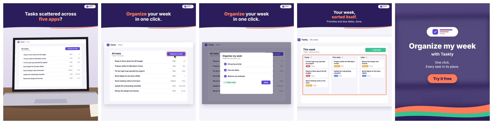
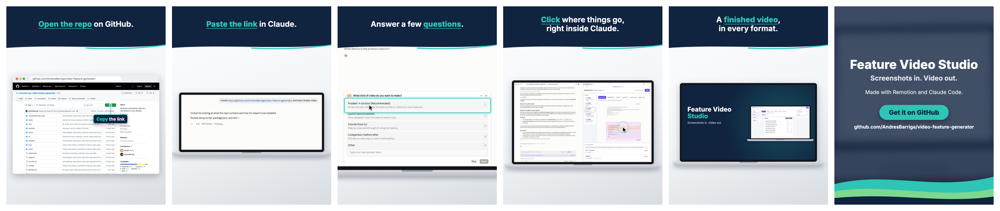

# Feature Video Studio

**Turn screenshots of your app into a short, polished feature video — just by chatting with Claude.**

No video editing, no code. You describe the feature, Claude writes the script
with you, tells you exactly which screenshots to take, builds the video, shows
you test frames, and delivers an MP4 ready for LinkedIn, your website or a
presentation.

**Example 1 — a demo for a fictional task app:**

▶ [Watch the demo video](docs/demo-video.mp4) (14 s, 4:5)

**Example 2 — this repo's own intro, made with the tool itself:**

▶ [How it works: from a GitHub link to a finished video](docs/feature-video-studio-intro.mp4) (18 s, 4:5 for LinkedIn)

It runs on **your own Claude subscription** (Claude Code in the Claude desktop
app) — no API keys, no per-video fees. Rendering happens on your computer.

---

## What you need (once)

1. **The Claude desktop app** with Claude Code (the **Code** tab) — included in
   Claude Pro / Max / Team / Enterprise plans. → [claude.ai/download](https://claude.ai/download)
2. **Node.js (LTS version)** — a free helper program that builds the video.
   → [nodejs.org](https://nodejs.org) → download the **LTS** installer → next, next, finish.
3. **This folder** on your computer: on GitHub click **Code → Download ZIP**,
   then unzip it somewhere with a short path, e.g. `Documents\video-feature-generator`.

Then double-click **`setup-windows.bat`** (Windows) or **`setup-mac.command`**
(Mac). It checks everything and installs what's missing (~2 minutes, once).

## Make a video (every time)

1. Open the **Claude desktop app → Code** tab.
2. Choose the unzipped folder (e.g. **video-feature-generator**) as the project folder.
3. Type **`/make-video`** (or just "I want to make a video for my new feature").
4. Answer Claude's questions, agree on the script, and drop in the screenshots
   it asks for (you can attach them right in the chat).
5. Review the test frames, ask for changes in plain words
   ("make the first caption shorter", "slower zoom on the result").
6. Get your MP4 in the `videos` folder.

A typical video takes **30–60 minutes** the first time (mostly script and
screenshots), less after that.

> **Try the demo first:** type *"Render the demo video"* — you'll get a sample
> video for a fictional task-management app in a couple of minutes.

## What the videos look like

- 12–20 seconds, silent, captions on top (readable on a phone).
- Opens on a real-world photo, dives into the device screen, shows the feature
  with a cursor, highlights, "look here" labels and zooms to details, ends on a
  branded card with your call to action.
- Your screenshots in a **browser, laptop, monitor, phone or iPad frame**, on a
  designed backdrop; text can be typed into fields; captions appear word by word.
- Your logo, colors and font. Formats: **portrait 4:5** (LinkedIn/Instagram),
  **square 1:1**, **landscape 16:9** (website, YouTube, slides) — Claude asks
  which ones you need and renders only those.
- Ready-made structures: **launch, quick tutorial, old vs new way, before/after,
  mobile app**. Other languages and shorter cuts as variants of the same video,
  plus a cover image for each format.
- You click where things go (cursor, highlights, labels, typed text, the device screen in a photo) on a small page instead of describing positions in words.
- Claude checks your screenshots before building (same size, big enough, right
  orientation) and `npm run doctor` explains any setup problem in plain words.

## Good to know

- **Use fictional data in screenshots.** Never real customer data.
- **Photos:** use photos you have the rights to (AI-generated is fine if your
  plan allows commercial use).
- **Remotion license:** the video engine ([Remotion](https://remotion.dev)) is
  free for individuals and small companies; larger companies need a company
  license — check [remotion.dev/license](https://remotion.dev/license).
- **Usage:** each video uses part of your Claude plan's usage. Building from the
  ready-made scenes is light; asking for custom animations uses much more.

## More

- [Quick start](docs/QUICKSTART.md) — from download to your first video in 10 minutes
- [User guide](docs/USER-GUIDE.md) — screenshots, reviewing, asking for changes, exports, editing text yourself
- [Config reference](docs/CONFIG-REFERENCE.md) — every option in `video.config.json`
- [Build guide](docs/BUILD-GUIDE.md) — how it works and how to extend it (for developers)
- [Craft rules](.claude/skills/make-video/references/craft-rules.md) — what makes these videos work

MIT licensed. Built with [Remotion](https://remotion.dev) and Claude Code.
